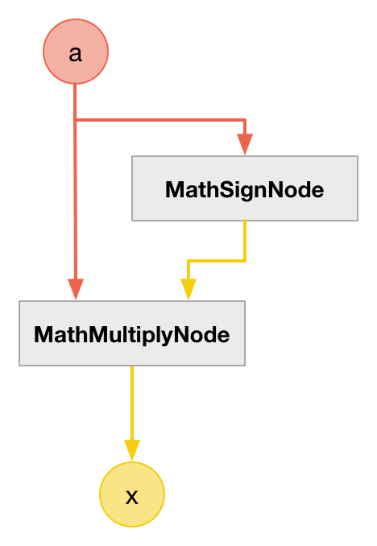
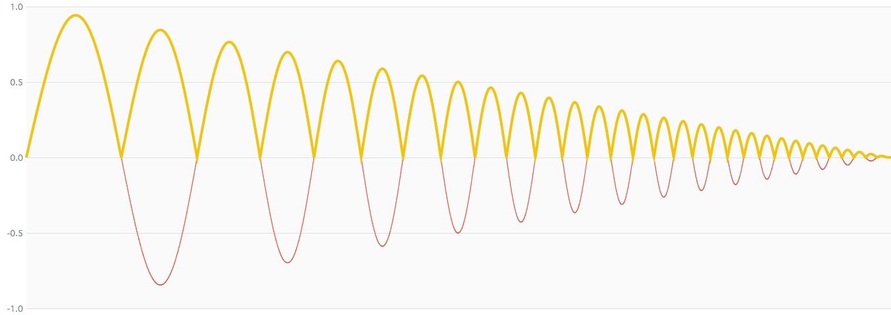

# MathAbsNode

### Expression

- `x = (a < 0) ? -a : +a`

### Code

`x = a * sign(a)`

```js
function createMathAbsNode(context, a) {
  var b = createMathSignNode(context, a);

  return createMathMultiplyNode(context, a, b);
}
```

### AudioGraph



### Plot



### Demo

http://mohayonao.github.io/waa-lab/MathAbsNode/
