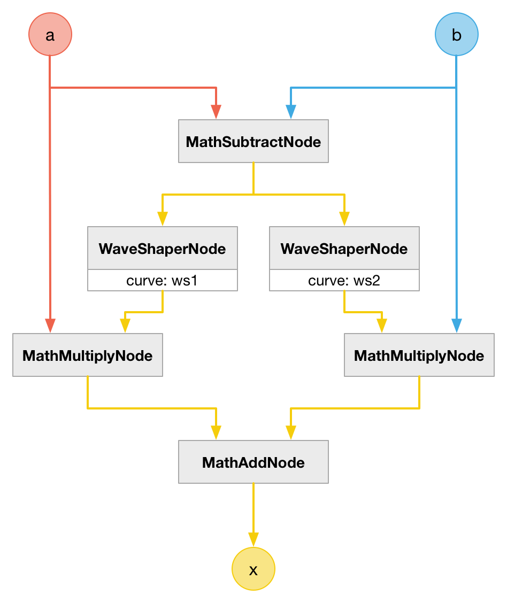

# MathMaxNode

### Expression

- `x = (a > b) ? a : b`

### Code

`x = a * ws1(a-b) + b * ws2(a-b)`

```js
function createMathMaxNode(context, a, b) {
  var expr = {};

  expr["a-b"] = createMathSubtractNode(context, a, b);

  expr["ws1(a-b)"] = createWaveShaperNode(context, ws1, expr["a-b"]);
  expr["a*ws1(a-b)"] = createMathMultiplyNode(context, a, expr["ws1(a-b)"]);

  expr["ws2(a-b)"] = createWaveShaperNode(context, ws2, expr["a-b"]);
  expr["b*ws2(a-b)"] = createMathMultiplyNode(context, b, expr["ws2(a-b)"]);

  expr["a*ws1(a-b)+b*ws2(a-b)"] = createMathAddNode(context, expr["a*ws1(a-b)"], expr["b*ws2(a-b)"]);

  return expr["a*ws1(a-b)+b*ws2(a-b)"];
}
```

### AudioGraph



### WaveShape


### Plot


### Demo

http://mohayonao.github.io/waa-lab/MathMaxNode/
