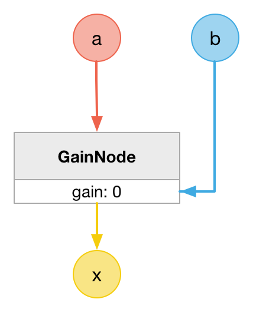

# MathMultiplyNode

### Expression

`x = a * b`

### Code

```js
function createMathMultiplyNode(context, a, b) {
  var x = context.createGain();

  a.connect(x);
  b.connect(x.gain);

  x.gain.value = 0;

  return x;
}
```

### AudioGraph



### Plot


### Demo

http://mohayonao.github.io/waa-lab/MathMultiplyNode/
