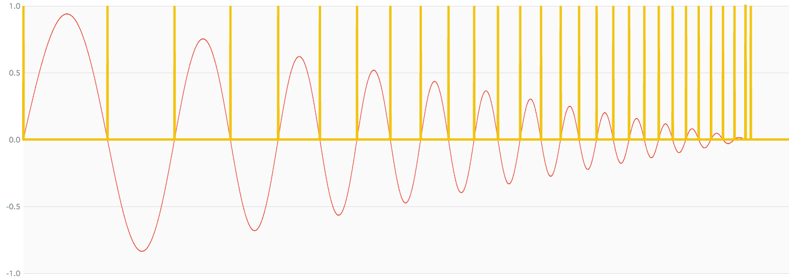

# ZeroCrossingNode

### Expression

- `x = (sign(a[t]) - sign(a[t-1])) != 0 ? 1 : 0`

### Code

`x = (sign(a) - sign(delay1(a))) != 0`

```js
function createZeroCrossingNode(context, a) {
  var b = createMathSignNode(context, a);
  var c = createDelay1Node(context, b);
  var d = createMathSignNode(context, c);
  var e = createMathSubtractNode(context, b, d);

  return createIsNotZeroNode(context, e);
}
```

### AudioGraph


### Plot



### Demo

http://mohayonao.github.io/waa-lab/ZeroCrossingNode/
