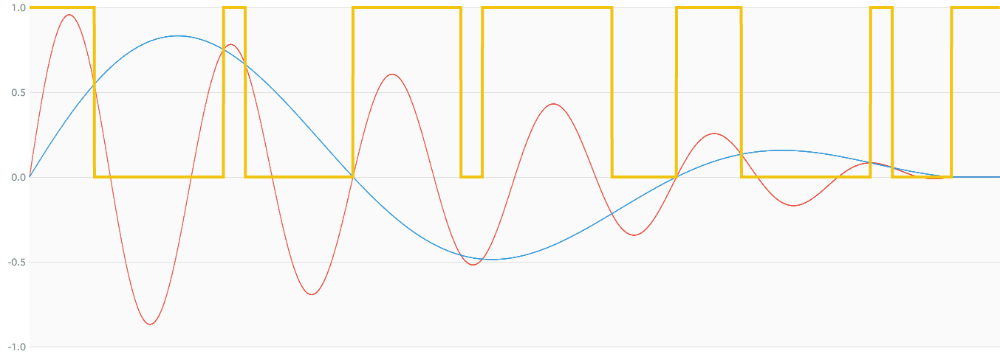

# CompareGreaterThanOrEqualToNode

### Expression

- `x = (a >= b) ? +1 : 0`

### Code

`x = (a - b) >= 0`

```js
function createCompareGreaterThanOrEqualToNode(context, a, b) {
  var c = createMathSubtractNode(context, a, b);

  return createIsPositiveOrZeroNode(context, c);
}
```

### AudioGraph


### Plot



### Demo

http://mohayonao.github.io/waa-lab/node/CompareGreaterThanOrEqualToNode/
