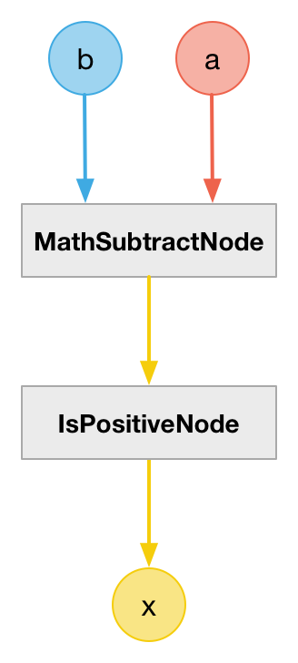

# CompareLessThanNode

### Expression

`x = (a < b) ? 1 : 0`

### Code

`x = ((b - a) > 0) ? 1 : 0`

```js
function createCompareLessThanNode(context, a, b) {
  var c = createMathSubtractNode(context, b, a);

  return createIsPositiveNode(context, c);
}
```

### AudioGraph



### Plot


### Demo

http://mohayonao.github.io/waa-lab/node/CompareLessThanNode/
