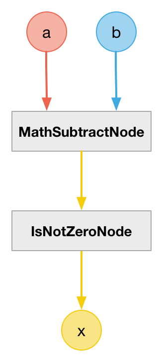

# CompareNotEqualToNode

### Expression

- `x = (a != b) ? +1 : 0`

### Code

`x = (a - b) != 0`

```js
function createCompareNotEqualToNode(context, a, b) {
  var c = createMathSubtractNode(context, a, b);

  return createIsNotZeroNode(context, c);
}
```

### AudioGraph



### Plot


### Demo

http://mohayonao.github.io/waa-lab/node/CompareNotEqualToNode/
