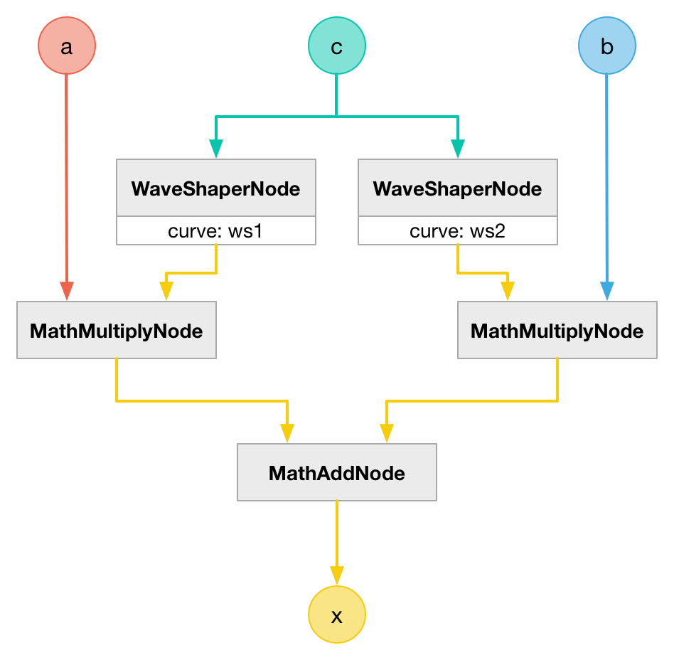
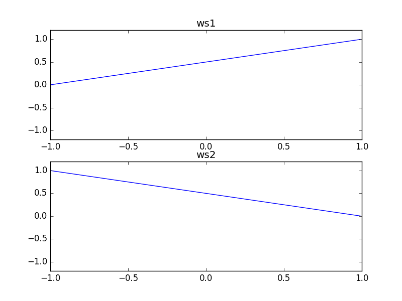

# CrossFadeNode

### Expression

`x = a * ((c + 1) * 0.5) + b * (1 - ((c + 1) * 0.5))`

### Code

`x = a * ws1(c) + b * ws2(c)`

```js
function createCrossFadeNode(context, a, b, c) {
  var a0 = createWaveShaperNode(context, ws1, c);
  var b0 = createWaveShaperNode(context, ws2, c);
  var a1 = createMathMultiplyNode(context, a, a0);
  var b1 = createMathMultiplyNode(context, b, b0);

  return createMathAddNode(context, a1, b1);
}
```

### AudioGraph



### WaveShape

- `ws1 = (x) -> (x + 1) * 0.5`
- `ws2 = (x) -> 1 - ((x + 1) * 0.5)`



### Plot


### Demo

http://mohayonao.github.io/waa-lab/node/CrossFadeNode/
