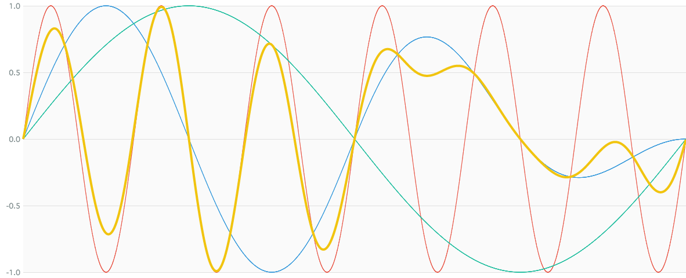

# CrossFadeNode

### Expression

`x = a * ((c + 1) * 0.5) + b * (1 - ((c + 1) * 0.5))`

### AudioGraph

### WaveShape

- `ws1 = (x) -> (x + 1) * 0.5`
- `ws2 = (x) -> 1 - ((x + 1) * 0.5)`

### Plot

  
http://mohayonao.github.io/waa-lab/node/CrossFadeNode/
