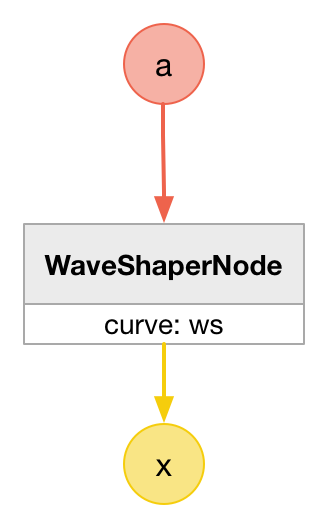
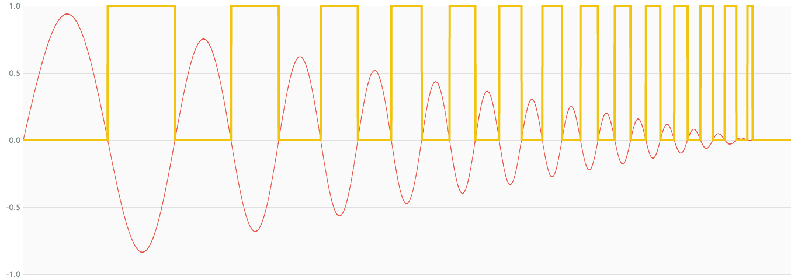

# IsNegativeNode

### Expression

`x = (a < 0) ? 1 : 0`

### Code

`x = ws(a)`

```js
function createIsNegativeNode(context, a) {
  return createWaveShaperNode(context, ws, a);
}
```

### AudioGraph



### WaveShape

`ws = (x) -> (x < 0) ? 1 : 0`


### Plot



### Demo

http://mohayonao.github.io/waa-lab/node/IsNegativeNode/
