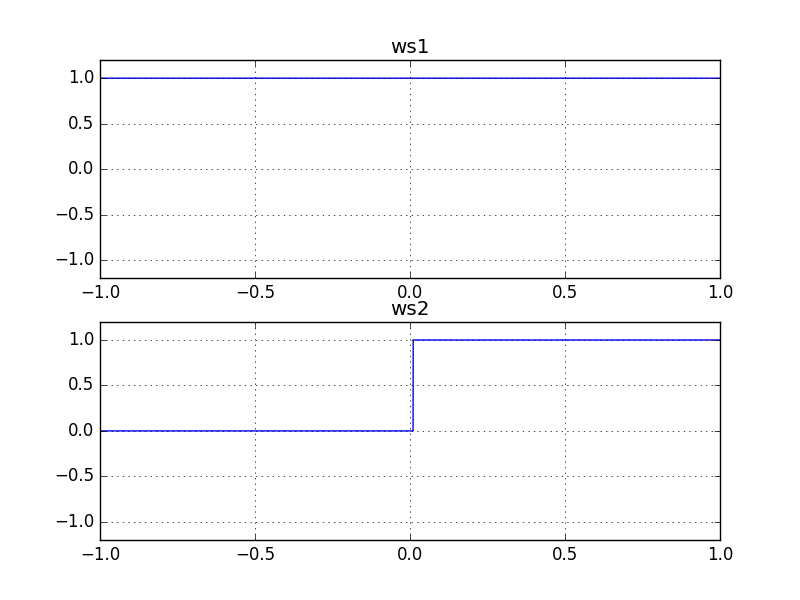
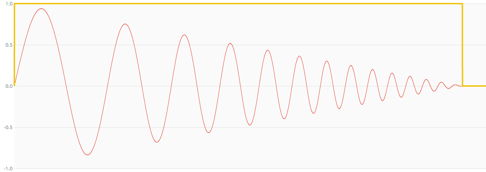

# IsNotZeroNode

### Expression

`x = (a != 0) ? 1 : 0`

### AudioGraph

### WaveShape

`ws1 = (x) -> (x != 0) ? 1 : 0`

_ws2 is used to provide stability the output._

### Plot

  
http://mohayonao.github.io/waa-lab/node/IsNotZeroNode/
