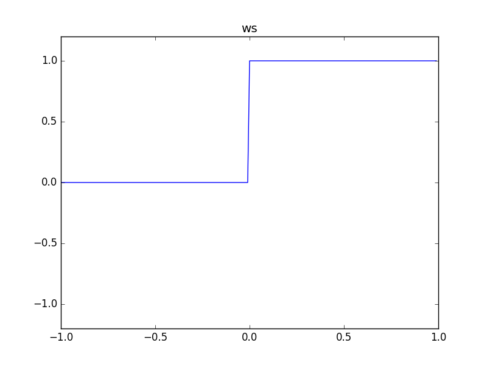
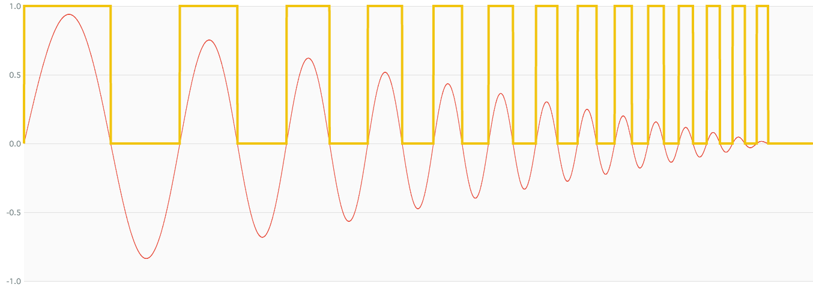

# IsPositiveNode

### Expression

- `x = (a > 0) ? +1 : 0`

### Code

`x = ws(a)`

```js
function createIsPositiveNode(context, a) {
  return createWaveShaperNode(context, ws, a);
}
```

### AudioGraph


### WaveShape

`ws = (x) -> (x > 0) ? +1 : 0`



### Plot



### Demo

http://mohayonao.github.io/waa-lab/node/IsPositiveNode/
