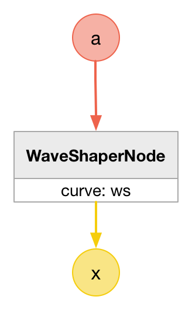
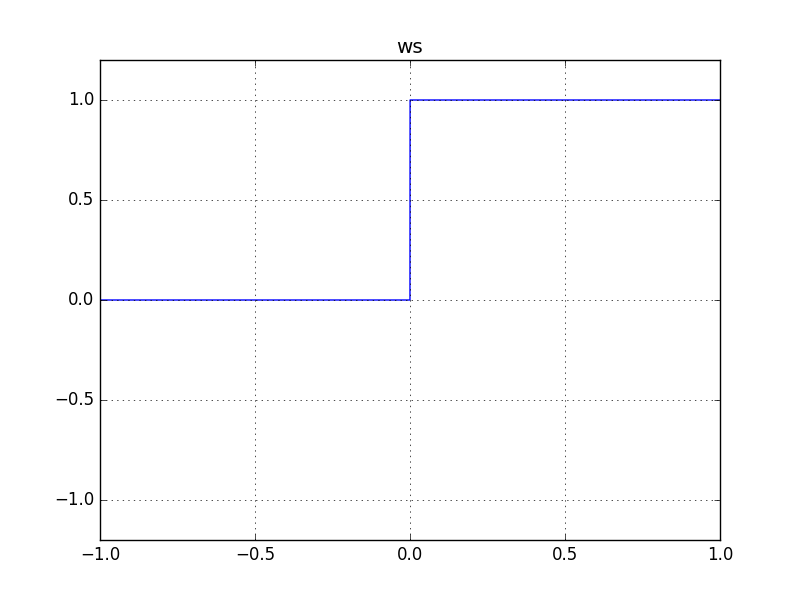

# IsPositiveOrZeroNode

### Expression

`x = (a >= 0) ? 1 : 0`

### AudioGraph

### WaveShape

`ws = (x) -> (x >= 0) ? 1 : 0`

### Plot

  
http://mohayonao.github.io/waa-lab/node/IsPositiveOrZeroNode/
