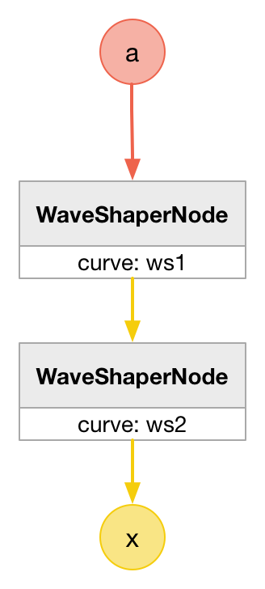
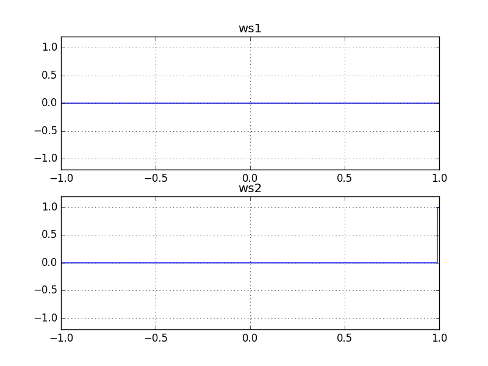

# IsZeroNode

### Expression

`x = (a == 0) ? 1 : 0`

### AudioGraph

### WaveShape

`ws = (x) -> (x == 0) ? 1 : 0`

_ws2 is used to provide stability the output._

### Plot

  
http://mohayonao.github.io/waa-lab/node/IsZeroNode/
