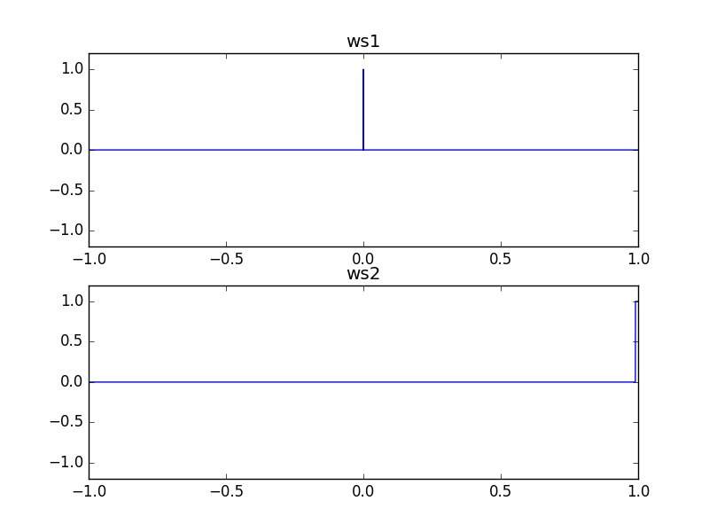

# IsZeroNode

### Expression

`x = (a == 0) ? 1 : 0`

### Code

`x = isPositive(ws(a))`

```js
function createIsZeroNode(context, a) {
  var b = createWaveShaperNode(context, ws, a);

  return createIsPositiveNode(context, b);
}
```

### AudioGraph


### WaveShape

`ws = (x) -> (x == 0) ? 1 : 0`

_ws2 is used to provide stability the output._



### Plot


### Demo

http://mohayonao.github.io/waa-lab/node/IsZeroNode/
