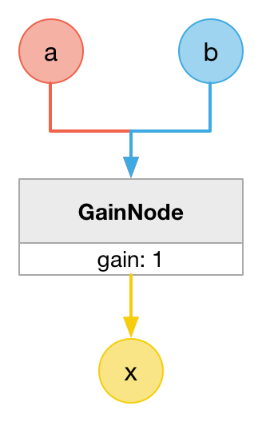

# MathAddNode

### Expression

`x = a + b`

### Code

`x = a + b`

```js
function createMathAddNode(context, a, b) {
  var x = context.createGain();

  a.connect(x);
  b.connect(x);

  return x;
}
```

### AudioGraph



### Plot


### Demo

http://mohayonao.github.io/waa-lab/node/MathAddNode/
