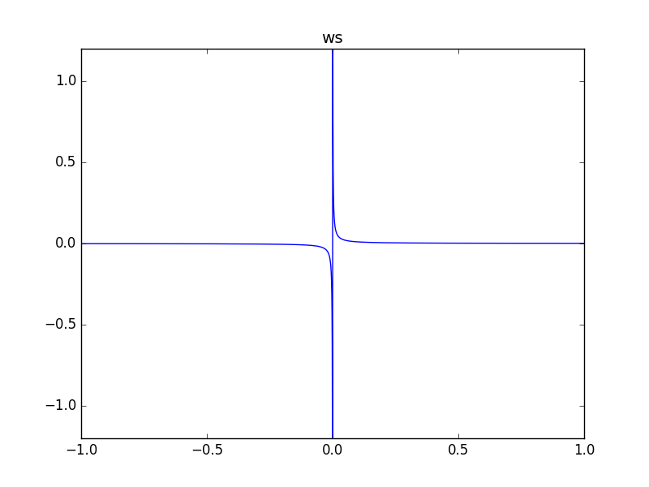
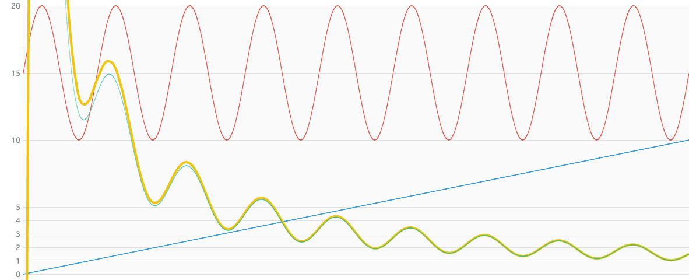

# MathDivideNode

### Expression

`x = a / b`

### Code

`x = a * ws(b * (1/MAX_VALUE))`

```js
function createMathDivideNode(context, a, b) {
  var c = createScaleGainNode(context, b, 1 / MAX_VALUE);
  var d = createWaveShaperNode(context, ws, c);

  return createMathMultiplyNode(context, a, d);
}
```

### AudioGraph


### WaveShape

`ws = (x) -> x == 0 ? 1 : (1 / (x * MAX_VALUE))`



### Plot

_Green line represents ideal computed values._



### Note

This method has an accuracy problem. So, this output does not strictly equal to the correct values. We need to choose better MAX_VALUE to improve the result.

### Demo

http://mohayonao.github.io/waa-lab/node/MathDivideNode/
