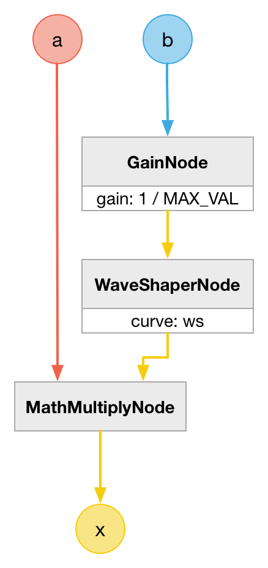
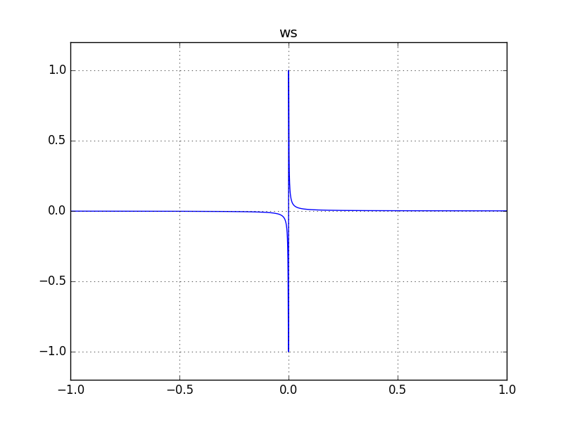

# MathDivideNode

### Expression

`x = a / b`

### AudioGraph

### WaveShape

`ws = (x) -> x == 0 ? 1 : (1 / (x * MAX_VALUE))`

### Plot

_Green line represents ideal computed values._

  
http://mohayonao.github.io/waa-lab/node/MathDivideNode/

### Note

This method has an accuracy problem. So, this output does not strictly equal to the correct values. We need to choose better MAX_VALUE to improve the result.
