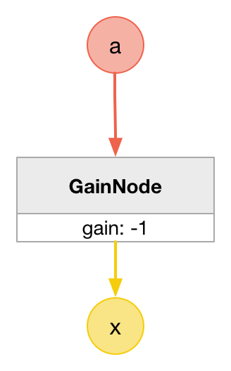
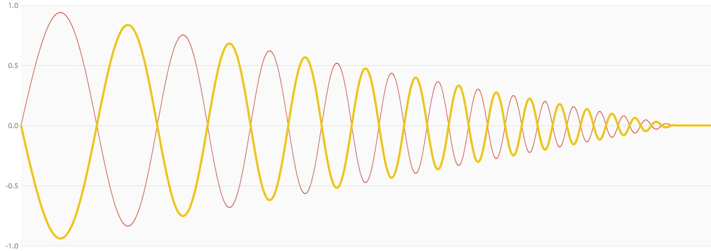

# MathInvertNode

### Expression

`x = -a`

### Code

```js
function createMathInvertNode(context, a) {
  var b = context.createGain();

  b.gain.value = -1;

  a.connect(b);

  return b;
}
```

### AudioGraph



### Plot



### Demo

http://mohayonao.github.io/waa-lab/node/MathInvertNode/
