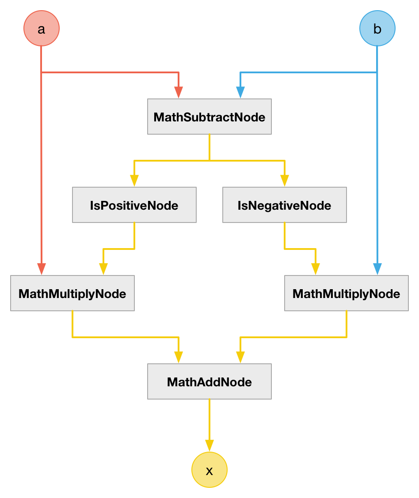

# MathMaxNode

### Expression

- `x = (a > b) ? a : b`

### Code

`x = a * isPositive(a-b) + b * isNegative(a-b)`

```js
function createMathMaxNode(context, a, b) {
  var c = createMathSubtractNode(context, a, b);
  var a0 = createIsPositiveNode(context, c);
  var a1 = createMathMultiplyNode(context, a, a0);
  var b0 = createIsNegativeNode(context, c);
  var b1 = createMathMultiplyNode(context, b, b0);

  return createMathAddNode(context, a1, b1);
}
```

### AudioGraph



### Plot


### Demo

http://mohayonao.github.io/waa-lab/node/MathMaxNode/
