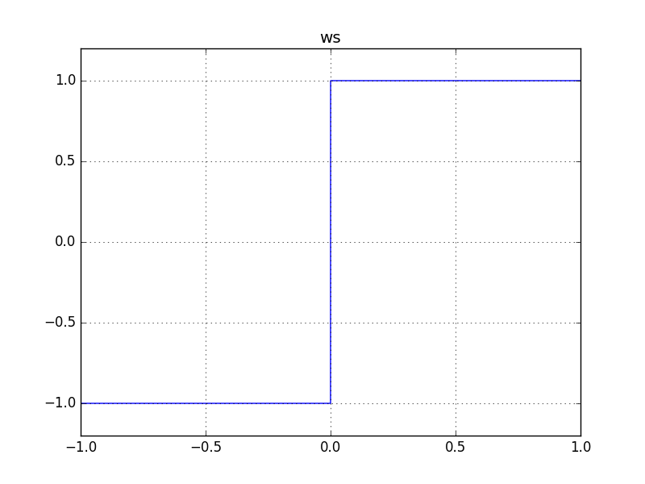

# MathSignNode

### Expression

`x = (a == 0) ? 0 : (a < 0) ? -1 : 1`

### AudioGraph

### WaveShape

`ws = (x) -> (x == 0) ? 0 : (x < 0) ? -1 : 1`

### Plot

  
http://mohayonao.github.io/waa-lab/node/MathSignNode/
