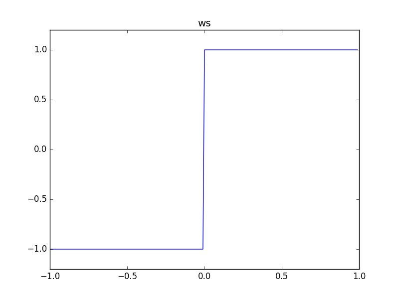

# MathSignNode

### Expression

`x = (a == 0) ? 0 : (a < 0) ? -1 : 1`

### Code

`x = ws(a)`

```js
function createMathSignNode(context, a) {
  return createWaveShaperNode(context, ws, a);
}
```

### AudioGraph


### WaveShape

`ws = (x) -> (x == 0) ? 0 : (x < 0) ? -1 : 1`



### Plot


### Demo

http://mohayonao.github.io/waa-lab/node/MathSignNode/
