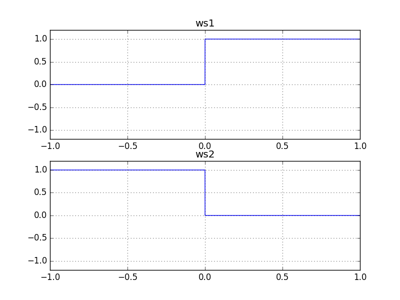
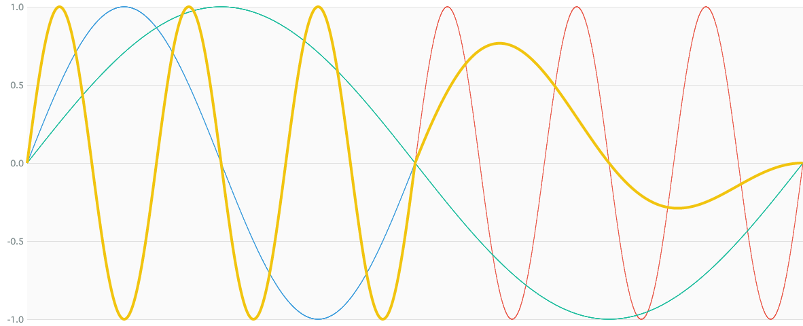

# SwitchNode

### Expression

`x = a * ((c > 0) ? 1 : 0) + b * ((c < 0) ? 1 : 0)`

### AudioGraph

### WaveShape

- `ws1 = (x) -> (x > 0) ? 1 : 0`
- `ws2 = (x) -> (x < 0) ? 1 : 0`

### Plot

  
http://mohayonao.github.io/waa-lab/node/SwitchNode/
