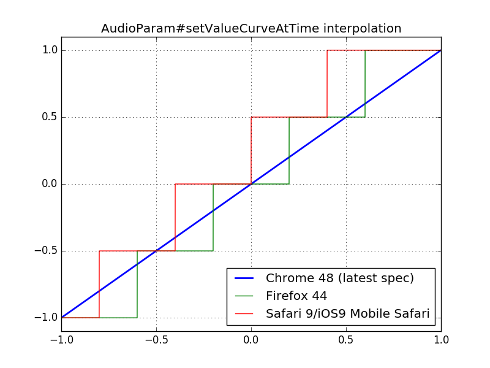

# AudioParam#setValueCurveAtTime Interpolation

### Comparison



### Simulator

```js
function spec(x, curve) {
  var ix, i0, i1, y0, y1, a;

  x = Math.max(-1, Math.min(x, 1));
  x = (x + 1) * 0.5;

  ix = x * (curve.length - 1);
  i0 = ix|0;
  i1 = i0 + 1;

  if (curve.length <= i1) {
    return curve[curve.length - 1];
  }

  y0 = curve[i0];
  y1 = curve[i1];
  a = ix % 1;

  return y0 + a * (y1 - y0);
}

function firefox(x, curve) {
  var i;

  x = Math.max(-1, Math.min(x, 1));
  x = (x + 1) * 0.5;

  i = (x * curve.length)|0;
  i = Math.min(i, curve.length - 1);

  return curve[i];
}

function safari(x, curve) {
  var i;

  x = Math.max(-1, Math.min(x, 1));
  x = (x + 1) * 0.5;
  x = x + (0.5 / curve.length);

  i = (x * curve.length)|0;
  i = Math.min(i, curve.length - 1);

  return curve[i];
}
```

### Try It
http://mohayonao.github.io/waa-lab/research/value-curve-interpolation/
